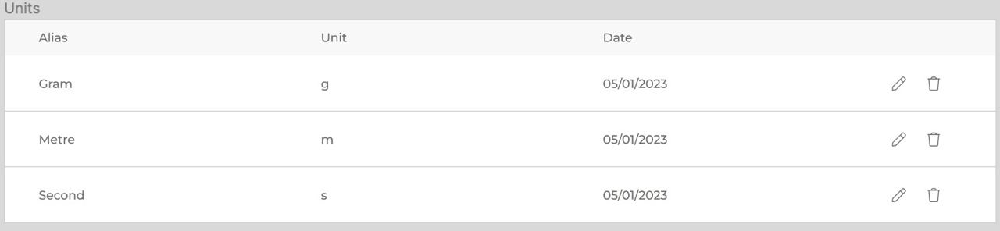

# crowdproj-units
Microservice for management and provisioning of the Units

## Frontend visual scheme

## Documentation

1. Marketing
    1. [Stakeholders](./docs/01-marketing/01-stakeholders.md)
    2. [Target Audience](./docs/01-marketing/02-target-audience.md)
    3. [Competitive Analysis](./docs/01-marketing/03-сompetitors.md)
    4. [Economic analysis](./docs/01-marketing/04-economy.md)
    5. [User Stories](./docs/01-marketing/05-user-stories.md)
2. DevOps
    1. [Infrastructure](./docs/02-devops/01-infrastructure.md)
    2. [Monitoring](./docs/02-devops/02-monitoring.md)
3. Tests
4. Architecture
    1. [Component Schema](./docs/04-architecture/01-arch.md)
    2. [Integration Schema](./docs/04-architecture/02-integration.md)
    3. [API Schema](./docs/04-architecture/03-api.md)

## MVP

CRUDS (Create, read, update, delete, search) units of measure